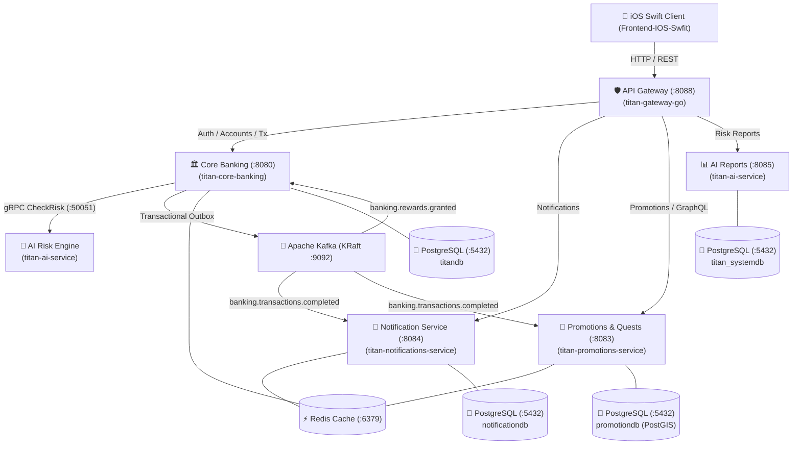

# 🏦 Titan Banking — Microservices Core Banking Ecosystem

A production-grade, distributed Core Banking system designed with microservices architecture, featuring high-throughput event streaming, real-time AI risk assessment, WebAssembly-powered promotional rule engines, and a native iOS Swift application.

---

## 🏛️ System Architecture Overview



---

## 📦 Services Breakdown
https://www.youtube.com/watch?v=ZK7f0ASDNAI
### 1. 📱 `Frontend-IOS-Swfit` (Native iOS Mobile Client)
* **Stack**: Swift 5.9, SwiftUI, Xcode Project (`Titan_Banking.xcodeproj`)
* **Key Modules**:
  * **Auth & Security**: Secure login, registration, biometric authentication, OTP verification.
  * **Accounts & Ledger**: Real-time account balances, transaction history, statement exports.
  * **Money Movements**: Instant internal transfers, deposit simulation, international wire transfers.
  * **Cardless ATM**: ATM cash withdrawal token generation, redemption, and cancellation.
  * **QR Payments**: KHQR and standardized QR code generator & scanner.
  * **Financial Products**: Fixed Term Deposits and Loan application tracking.
  * **Gamification & Rewards**: Quests, referral tree visualization, promotional bonuses, and leaderboard.
  * **Notifications**: Push notification integration and in-app message inbox.

---

### 2. 🛡️ `titan-gateway-go` (API Gateway & Security Layer)
* **Stack**: Go (Golang 1.21+)
* **Port**: `8088`
* **Responsibilities**:
  * **Unified Reverse Proxy**: Routes incoming traffic across all backend microservices.
  * **Sliding-Window Rate Limiter**: IP-based rate limiting with automatic temporary blacklisting for abusive clients.
  * **JWT Authentication**: Validates HS256 JWT tokens before proxying requests to downstream internal services.
  * **Public Route Whitelisting**: Allows unauthenticated access to auth endpoints (`/api/v1/auth/*`, `/api/auth/otp/*`), health probes, and external webhooks.
  * **Observability Endpoints**:
    * `GET /health`: Gateway status, upstream health, rate-limiter configuration.
    * `GET /health/rate-limits`: Currently blocked IP list and metrics.
    * `GET /routes`: Full live routing table mapping.

---

### 3. 🏛️ `titan-core-banking` (Core Ledger & Banking Engine)
* **Stack**: Java 21, Spring Boot 3, Spring Security, Spring Data JPA, Hibernate, Kafka, Redis, gRPC Client
* **Port**: `8080` (HTTP) / `9090` (gRPC)
* **Database**: PostgreSQL (`titandb`)
* **Responsibilities**:
  * **Ledger Management**: Double-entry ledger, multi-currency account creation, and balance tracking.
  * **Transaction Processing**: High-concurrency atomic transfers, deposits, withdrawals, and scheduled payments.
  * **Real-time Risk Hook**: Synchronous gRPC client calling `titan-ai-service` (`CheckRisk`) before approving transfers.
  * **Transactional Outbox Pattern**: Publishes `banking.transactions.completed` events to Kafka safely within database transactions.
  * **Advanced Financial Protocols**:
    * **CBDC & FX**: Central Bank Digital Currency exchange and Foreign Exchange conversion.
    * **Cryptographic Merkle Tree**: Tamper-evident transaction integrity verification.
    * **HTLC & SSI**: Hash Time Locked Contracts and Self-Sovereign Identity verification modules.

---

### 4. 🧠 `titan-ai-service` (Real-Time AI Risk & Fraud Engine)
* **Stack**: Python 3.11, gRPC, FastAPI, Pydantic, Psycopg2
* **Ports**: `50051` (gRPC) & `8085` (HTTP)
* **Database**: PostgreSQL (`titan_systemdb`)
* **Responsibilities**:
  * **gRPC Risk Evaluation (`CheckRisk`)**:
    * Transfers < $1,000 → `Score: 10` (LOW / ALLOW)
    * Transfers $1,000 – $9,999 → `Score: 50` (MEDIUM / REVIEW)
    * Transfers >= $10,000 → `Score: 100` (BLOCKED / HIGH-VALUE BLOCK)
  * **Audit & Storage**: Automatically logs all risk scoring evaluations and blocked transfers into `risk_events` and `blocked_transfers`.
  * **FastAPI Analytics API**:
    * `GET /api/reports/risk`: Paginated transaction risk history.
    * `GET /api/reports/blocked`: Blocked transaction log.
    * `GET /api/reports/stats`: Aggregate fraud and risk metrics.
    * `GET /api/reports/stats/daily`: Daily risk summary breakdowns.

---

### 5. 🔔 `titan-notifications-service` (Event-Driven Notification Hub)
* **Stack**: Java 21, Spring Boot 3, Kafka Consumer, Redis, PostgreSQL
* **Port**: `8084`
* **Database**: PostgreSQL (`notificationdb`)
* **Responsibilities**:
  * **Event Consumption**: Listens to Kafka topics (`banking.transactions.completed`, `banking.rewards.granted`, etc.).
  * **Multi-Channel Delivery**: Push notifications, SMS alerts, Email summaries, and Outbound Webhooks.
  * **User Preferences**: Fine-grained opt-in/opt-out settings per notification category.
  * **Resilience & DLQ**: Dead Letter Queue consumer (`banking.notifications.dlq`) with exponential backoff and poison pill isolation.
  * **Chaos Testing**: Built-in `/chaos/*` endpoints for resilience and latency fault injection testing.

---

### 6. 🎁 `titan-promotions-service` (Gamification, Quests & Promotions Engine)
* **Stack**: Java 21, Spring Boot 3, PostGIS, WebAssembly (Wasm), GraphQL / GraphiQL, Kafka Streams, Redis
* **Port**: `8083`
* **Database**: PostgreSQL (`promotiondb` with PostGIS extension)
* **Responsibilities**:
  * **Campaign Engine**: Configurable deposit bonuses (e.g., $100 deposit → $2 instant bonus) and cashbacks.
  * **Gamified Quests**: State-machine driven missions for onboarding and engagement milestones.
  * **Referral Graph**: Referral hierarchies and multi-tier rewards.
  * **Wasm Rule Sandbox**: Ultra-fast, sandboxed rule evaluation via WebAssembly modules (`.wat` / `.wasm`).
  * **Geospatial Merchant Federation**: PostGIS-enabled location-based offers for partner merchants.
  * **GraphQL Supergraph & Leaderboard**: Real-time GraphQL queries, mutations, and WebSocket subscriptions for user leaderboards.

---

### 7. 📚 `titan-event-consumer-lib` (Shared Event Framework)
* **Stack**: Java 21, Spring Kafka Library
* **Responsibilities**:
  * Shared base classes (`BaseEventConsumer`) for standardizing Kafka consumer error handling.
  * Automatic Dead Letter Queue (`DLQProducer`) publication for poison messages.
  * Consistent deserialization and idempotency checks across all Java microservices.

---

### 8. 🗄️ `init-db` & Infrastructure
* **PostgreSQL**: Multi-database instance automatically provisioning `titandb`, `notificationdb`, `promotiondb`, and `titan_systemdb` with PostGIS extensions.
* **Apache Kafka (KRaft)**: High-performance messaging cluster running without ZooKeeper; `kafka-init` creates required partitioned topics on startup.
* **Redis**: Distributed lock management, caching, and rate limiting.
* **Grafana & Prometheus**: Pre-configured dashboards and alerting for service monitoring.

---

## 🚦 Kafka Topic Architecture

| Topic Name | Partitions | Producers | Consumers | Description |
| :--- | :---: | :--- | :--- | :--- |
| `banking.transactions.completed` | 3 | Core Banking | Notifications, Promotions | Broadcasted upon successful transaction |
| `banking.accounts.created` | 3 | Core Banking | Notifications, Promotions | Triggered when a new bank account is opened |
| `banking.accounts.updated` | 3 | Core Banking | Notifications | Triggered on profile/tier updates |
| `banking.atm.withdrawals` | 3 | Core Banking | Notifications | Cardless ATM cash collection events |
| `banking.promotions.rewards` | 3 | Promotions | Core Banking, Notifications | Promotional bonus payouts |
| `banking.rewards.granted` | 3 | Promotions | Core Banking, Notifications | Quest & referral rewards granted |
| `banking.rewards.acknowledgment` | 3 | Core Banking | Promotions | Confirmation of reward ledger balance credit |
| `banking.transactions.dlq` | 1 | Core Banking | Ops / DLQ Consumers | Failed transaction events for retry/audit |
| `banking.notifications.dlq` | 1 | Notifications | Ops / DLQ Consumers | Failed notification delivery events |
| `banking.transactions.poison` | 1 | Event Consumer Lib | Ops Admin | Unprocessable poison pill events |

---

## 🚀 Quick Start Guide

### Prerequisites
* [Docker Desktop](https://www.docker.com/) (with Compose v2)
* [Java 21 JDK](https://adoptium.net/) (for local development)
* [Go 1.21+](https://go.dev/) (for gateway development)
* [Python 3.11+](https://www.python.org/) (for AI risk engine)
* [Xcode 15+](https://developer.apple.com/xcode/) (for iOS frontend)

### 1. Run the Entire Ecosystem via Docker Compose
```bash
# Clone the repository
git clone https://github.com/Bunchhay1/Microservice-Core-Bank-API-With-Swift.git
cd Microservice-Core-Bank-API-With-Swift

# Start all containers in background
docker compose up -d --build
```

### 2. Check Service Health
```bash
# Gateway Health & Upstreams
curl http://localhost:8088/health

# Gateway Route Map
curl http://localhost:8088/routes

# Core Banking Health
curl http://localhost:8080/actuator/health

# AI Risk Engine Health
curl http://localhost:8085/health

# Notifications Service Health
curl http://localhost:8084/actuator/health

# Promotions Service Health
curl http://localhost:8083/actuator/health
```

### 3. Running the iOS App
1. Open `Frontend-IOS-Swfit/Titan_Banking.xcodeproj` in **Xcode**.
2. Set your active target simulator (e.g. iPhone 15 Pro).
3. Ensure backend services are running (`http://localhost:8088`).
4. Press `Cmd + R` to build and run.

---

## 🔒 Security Best Practices
* **Zero Credential Hardcoding**: Passwords and secrets are injected through runtime environment variables (`JWT_SECRET`, `DB_PASSWORD`).
* **Rate Limiting & IP Blocking**: Enforced at the API Gateway boundary to prevent DDoS and brute-force attacks.
* **Dual-Layer Fraud Protection**: Every transfer is scrutinized in real-time by the Python AI Risk Engine before execution.
* **Transactional Outbox**: Guarantees zero message loss between the database state and Kafka brokers.
